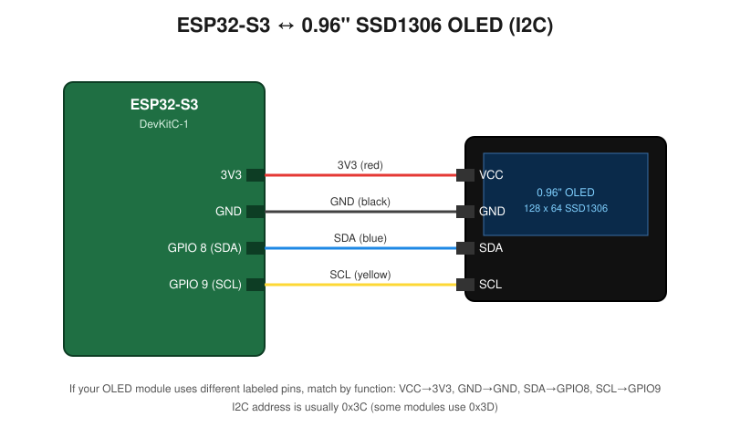

# ESP32-S3 OLED GIF Animation Player – Radhima

Play a full-screen animated GIF (converted to a C byte array) on a 0.96" SSD1306 OLED display using an ESP32-S3.

## 📋 Description

This project drives a 128x64 monochrome OLED display over I2C on an ESP32-S3 board and plays back a pre-converted animated GIF ("Radhima") frame by frame, straight from flash memory (`PROGMEM`). The animation data lives in `animation.h` as a compact bitmap array, and `radhima.ino` handles I2C setup, frame decoding, and display refresh.

Originally built for standard ESP32, this version has been adapted for **ESP32-S3**, with explicit I2C pin configuration since the S3's default SDA/SCL pins differ from classic ESP32 boards.

## ✨ Features

- Smooth full-screen GIF animation on a 128x64 OLED
- Frame data stored in flash (`PROGMEM`) — low RAM usage
- Supports animations with more than 255 frames (`uint16_t` frame indexing)
- Simple, single-file animation data format — easy to swap in your own GIF
- Configurable I2C pins and display address

## 🛠 Hardware Required

| Component | Notes |
|---|---|
| ESP32-S3 Dev Board | e.g. ESP32-S3-DevKitC-1 |
| 0.96" OLED Display | SSD1306 driver, 128x64, I2C |
| Jumper wires | 4x (VCC, GND, SDA, SCL) |
| USB-C cable | For programming/power |

## 🔌 Wiring

| OLED Pin | ESP32-S3 Pin |
|---|---|
| VCC | 3V3 |
| GND | GND |
| SDA | GPIO 8 |
| SCL | GPIO 9 |

> If your board or breakout uses different pins, update `OLED_SDA` and `OLED_SCL` at the top of `radhima.ino`.

See `circuit_diagram.svg` for the full wiring diagram.

## 📚 Libraries Required

Install via Arduino IDE Library Manager:

- `Adafruit GFX Library`
- `Adafruit SSD1306`

Board support: install **esp32 by Espressif Systems** via Boards Manager, then select an ESP32-S3 board (e.g. "ESP32S3 Dev Module").

## 🚀 Getting Started

1. Clone this repository.
2. Open `radhima.ino` in the Arduino IDE.
3. Install the required libraries listed above.
4. Select **Tools → Board → ESP32S3 Dev Module** (or your specific S3 board).
5. Wire the OLED as shown in the table/diagram above.
6. Upload the sketch.
7. The Radhima animation should start playing on the OLED automatically.

## 🖼 Using Your Own Animation

To use a different GIF:
1. Convert your GIF into the same `AnimatedGIF` struct format used in `animation.h` (frame count, width, height, per-frame delays, and 1-bit packed frame data).
2. Replace `animation.h` with your generated file, keeping the struct name consistent (or update the reference in `radhima.ino`).

## 📄 License

Feel free to use, modify, and share this project for personal or educational purposes. Credit is appreciated but not required.

## 🙌 Credits

Created by **GSNCREATIONS**

- YouTube: [@GSNcreation07](https://www.youtube.com/@GSNcreation07)
- Instagram: [@GSNCREATIONS](https://instagram.com/GSNCREATIONS)

Keep Creating • Keep Learning • Keep Innovating
